# Analisi del Dataset Azure Functions Invocation Trace

- [Analisi del Dataset Azure Functions Invocation Trace](#analisi-del-dataset-azure-functions-invocation-trace)
  - [Introduzione](#introduzione)
  - [Dataset](#dataset)
    - [Attribuzione](#attribuzione)
  - [Prerequisiti per l'esecuzione del codice](#prerequisiti-per-lesecuzione-del-codice)
  - [Utilizzo](#utilizzo)
  - [Codice e analisi](#codice-e-analisi)
    - [0. Caricamento e preparazione del dataset](#0-caricamento-e-preparazione-del-dataset)
    - [1. Analisi della durata delle invocazioni](#1-analisi-della-durata-delle-invocazioni)
    - [2. Analisi dei pattern temporali](#2-analisi-dei-pattern-temporali)
      - [Analisi delle invocazioni per data](#analisi-delle-invocazioni-per-data)
      - [Analisi delle invocazioni per all'ora del giorno](#analisi-delle-invocazioni-per-allora-del-giorno)
    - [3. Rapporto fra applicazioni e funzioni](#3-rapporto-fra-applicazioni-e-funzioni)
      - [Numero di funzioni per applicazione](#numero-di-funzioni-per-applicazione)
      - [Numero di invocazioni per applicazione](#numero-di-invocazioni-per-applicazione)
      - [Relazione fra durata media delle invocazioni e numero di funzioni dell'applicazione](#relazione-fra-durata-media-delle-invocazioni-e-numero-di-funzioni-dellapplicazione)
      - [Durata media delle singole funzioni per ogni applicazione](#durata-media-delle-singole-funzioni-per-ogni-applicazione)
      - [Analisi di applicazioni con più di una funzione](#analisi-di-applicazioni-con-più-di-una-funzione)

  
<div style="page-break-before: always;"></div>

## Introduzione
Azure Functions è una piattaforma serverless fornita da Microsoft Azure che consente di sviluppare ed eseguire frammenti di codice (*funzioni*) senza dover gestire l'infrastruttura sottostante.

Il progetto in esame utilizza il dataset *Azure Functions Invocation Trace 2021* per estrarre pattern temporali delle invocazioni delle funzioni all'interno di Azure Functions e per individuare le relazioni tra le funzioni e le applicazioni che le invocano.


## Dataset
Il dataset di Azure Functions Invocation Trace, disponibile al seguente [link](https://github.com/Azure/AzurePublicDataset/blob/master/AzureFunctionsInvocationTrace2021.md), contiene dati di tracciamento delle invocazioni delle funzioni in Azure Functions per un periodo di due settimane a partire dal 31 gennaio 2021. <br>
Lo schema del dataset è il seguente:

- `app`: ID dell'applicazione. Questo campo identifica univocamente l'applicazione che ha invocato la funzione. L'ID è crittografato per motivi di sicurezza e non rivela direttamente il nome dell'applicazione;
- `func`: ID della funzione all'interno di un'applicazione. Questo campo identifica la funzione specifica invocata. Similmente all'ID dell'applicazione, anche l'ID della funzione è crittografato;
- `end_timestamp`: timestamp di fine invocazione della funzione. Indica l'ora di fine dell'esecuzione di una funzione, espressa in timestamp Unix (numero di secondi trascorsi dal 1° gennaio 1970);
- `duration`: durata dell'invocazione della funzione. Misura quanto tempo ha impiegato la funzione per completare la sua esecuzione.

### Attribuzione
*Yanqi Zhang, Íñigo Goiri, Gohar Irfan Chaudhry, Rodrigo Fonseca, Sameh Elnikety, Christina Delimitrou, Ricardo Bianchini. "Faster and Cheaper Serverless Computing on Harvested Resources", in Proceedings of the ACM International Symposium on Operating Systems Principles (SOSP), October 2021.*

## Prerequisiti per l'esecuzione del codice
In questa sezione sono elencati i prerequisiti software necessari all'esecuzione del codice:
- **Python**: l'applicazione è stata sviluppata e testata su Python versione 3.9, che è possibile scaricare dal sito ufficiale: [python.org](https://www.python.org/);
- **Librerie Python**: sono necessarie le seguenti librerie Python: 
  - *seaborn*
  - *pandas*
  - *numpy*
  - *matplotlib*
  
  Possono essere installate direttamente dal file `requirements.txt` presente nella cartella del progetto, usando il comando: `pip install -r requirements.txt`.
<div style="page-break-before: always;"></div>

## Utilizzo
Per eseguire il programma, dopo aver clonato il repository, è necessario:
1.  decomprimere il dataset presente nella cartella `AzureFunctionsInvocationTrace\dataset`;
2.  avviare il file `main.py`:
    ```
    python main.py
    ```

## Codice e analisi
In questa sezione vengono mostrate le parti principali del codice e analizzati i risultati emersi.

### 0. Caricamento e preparazione del dataset

```
# Load data
csv_file_path = 'dataset/azure_functions_invocation_trace.csv'
data = pd.read_csv(csv_file_path)

# Show info about data
print(f"\nDataset info:")
data.info()
print(f"\nHead of dataset:\n{data.head()}\n")

# Convert timestamp to datetime
data['end_timestamp'] = pd.to_datetime(data['end_timestamp'], unit='s')
new_start_date = pd.Timestamp('2021-01-31')
time_shift = new_start_date - data['end_timestamp'].min()
data['end_timestamp'] = data['end_timestamp'] + time_shift
data['hour'] = data['end_timestamp'].dt.hour
data['day_of_week'] = data['end_timestamp'].dt.dayofweek
data['date'] = data['end_timestamp'].dt.date
```
Dopo il caricamento del dataset, vengono mostrate alcune informazioni generali sul dataset di partenza, da cui emerge che il dataset è composto da:
- 1980951 record: ciascuno rappresenta un'invocazione di una funzione;
- 4 colonne: 
  1. `app`: campo di tipo `object`; 
  2. `func`: campo di tipo `object`; 
  3. `end_timestamp`: campo di tipo `float64`; 
  4. `duration`: campo di tipo `float64`.

Il campo `end_timestamp` è stato convertito in formato datetime e traslato nel giorno 31 gennaio 2021 per condurre un'analisi temporale più accurata.
### 1. Analisi della durata delle invocazioni
La prima fase dell'analisi si è concentrata sulla durata delle invocazioni. 
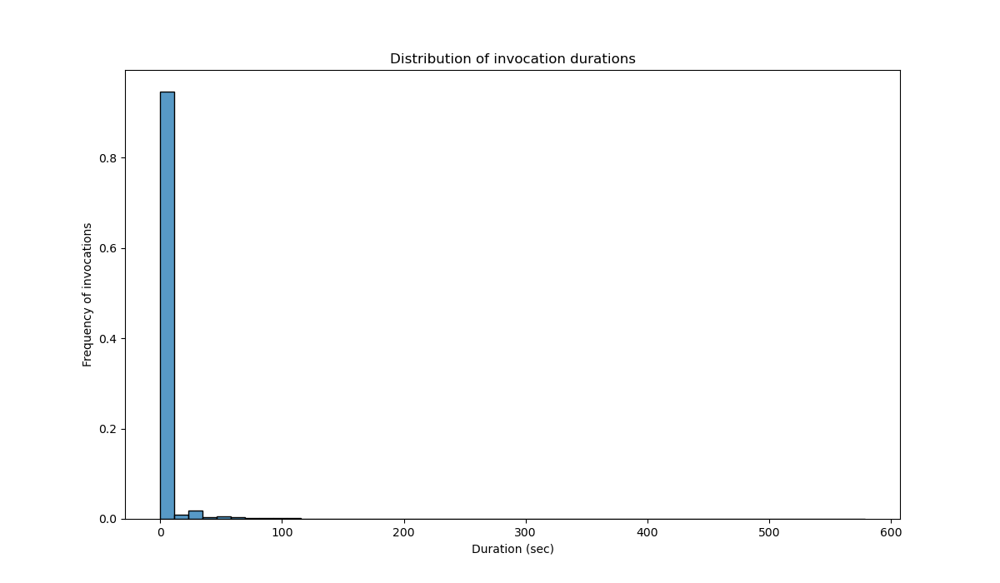
L'istogramma mostra la distribuzione della durata delle invocazioni. È possibile notare che:
- la distribuzione è fortemente asimmetrica verso destra (*right-skewed*), il che significa che la maggior parte delle invocazioni ha una durata molto breve, con un'alta concentrazione vicino allo zero;
- c'è una lunga coda verso destra che indica la presenza di alcune invocazioni con durate molto lunghe.

Le statistiche descrittive della durata delle invocazioni confermano che:
- la durata media delle invocazioni è di circa 3.35 secondi;
- la mediana è di 0.031 secondi, significativamente inferiore alla media;
- la deviazione standard è piuttosto elevata (18.51 secondi), indicando una grande variabilità nelle durate;
- il valore minimo è 0 secondi, mentre il massimo è 578.62 secondi (circa 9.6 minuti).
### 2. Analisi dei pattern temporali

#### Analisi delle invocazioni per data
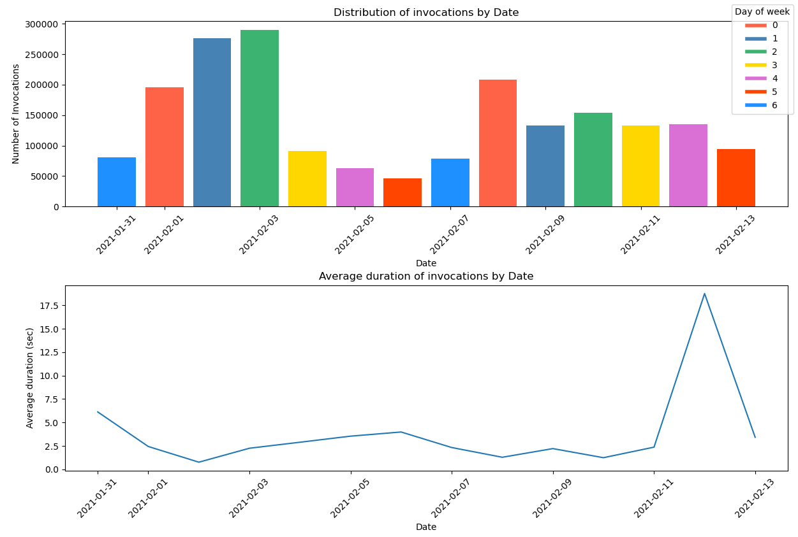
1. Nel primo grafo è mostrato il numero di invocazioni per data. 
   -  È possibile notare che ci sono variazioni significative nel numero di invocazioni nel tempo: alcune date mostrano picchi di attività molto  elevati, mentre altre hanno un numero di invocazioni relativamente   basso.
   - Non emergono pattern ricorrenti sulle invocazioni per   giorno della settimana, anche se è possibile notare un leggero aumento  delle invocazioni nei primi giorni della settimana (0, 1, 2) e la  descrescita nel weekend. 
2. Il secondo grafo mostra la durata media delle invocazioni per data.
    - È possibile notare un picco significativo il giorno 12/02/2021. Questo picco potrebbe indicare un evento particolare che ha causato un aumento della durata media delle invocazioni in quel giorno specifico, oppure potrebbe trattarsi di un'anomalia nei dati causata da un errore di registrazione o da un problema di sistema. 

Il grafo successivo è stato utilizzato per verificare se il fenomeno osservato sia stato causato da outlier isolati (anomalie nei dati) o da un problema più generale che ha interessato l'intera giornata, come un disservizio infrastrutturale.

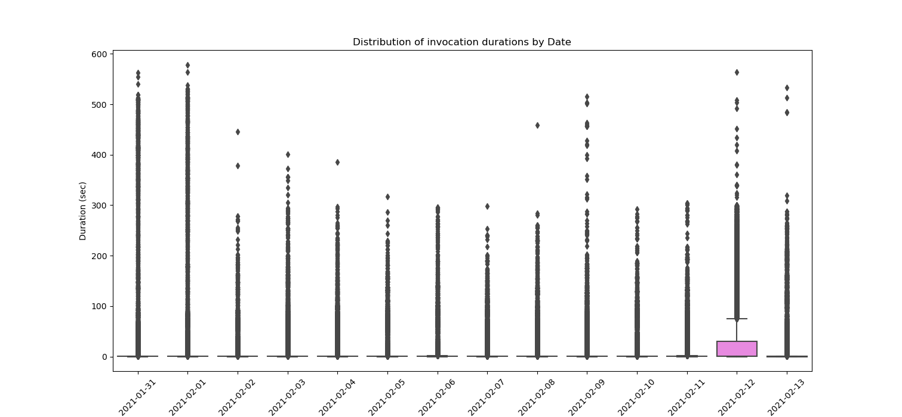
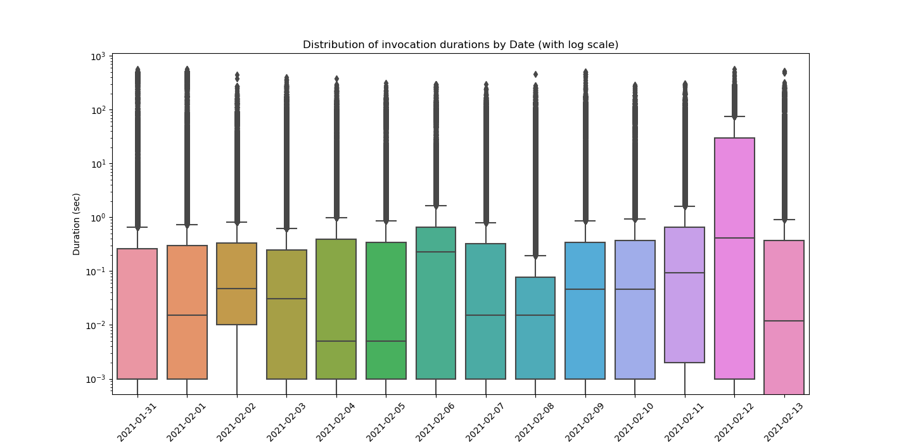
- Dal grafo possiamo notare la presenza di outlier in tutti i giorni di osservazione, quindi non solo per il giorno 12/02/2021; 
- La mediana elevata del giorno suggerisce che molte delle invocazioni hanno richiesto più tempo rispetto agli altri giorni.

Questo rafforza l'ipotesi di un problema sistematico che ha interessato tutta la giornata.

#### Analisi delle invocazioni per all'ora del giorno
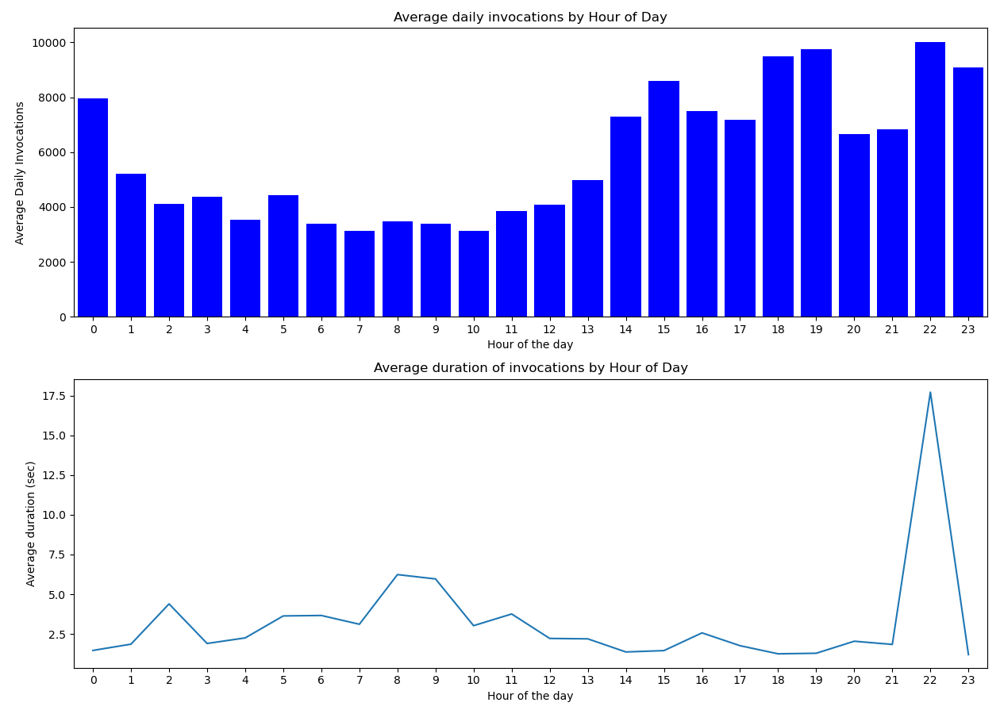
1. Nel primo grafo è mostrato il numero medio di invocazioni per ora della giornata. 
   -  È possibile osservare che le invocazioni tendono a diminuire nelle prime ore della mattina, per aumentare gradualmente nelle ore del pomeriggio. La maggior parte si concentrano la sera.
2. Il secondo grafo mostra come varia la durata media delle invocazioni durante le 24 ore del giorno.
    - Anche in questo caso possiamo notare un picco molto accentuato alle 22 di sera. Per approfondire la natura di questo fenomeno è stato usato l'approccio visto in precedenza.

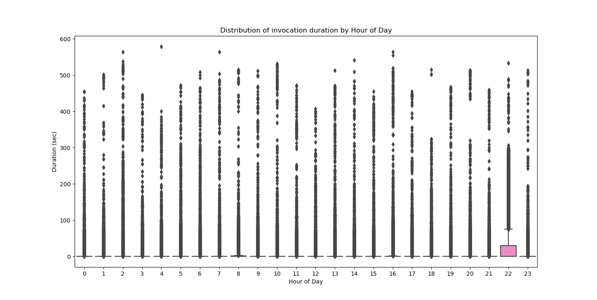
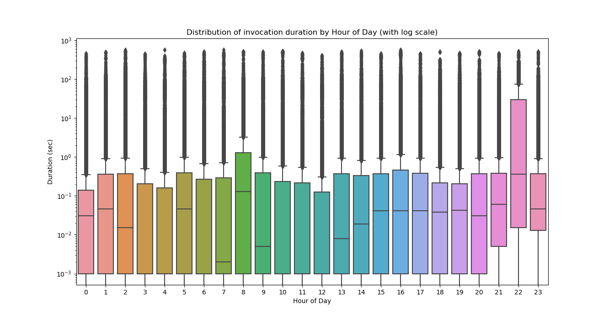
- Possiamo notare la presenza di outlier in tutte le ore, non solo alle 22; 
- Anche in questo caso la mediana più alta alle 22 conferma che la maggior parte delle invocazioni in quell'ora richiede un tempo di elaborazione maggiore rispetto alle altre altre ore della giornata.

Questo può suggerire che le invocazioni che avvengono alle 22 sono più complesse o richiedono più tempo magari a causa di processi batch.

### 3. Rapporto fra applicazioni e funzioni
```
#Renaming apps
app_names = data['app'].unique()
rename_map = {app: f'app_{i+1}' for i, app in enumerate(app_names)}
data['app'] = data['app'].replace(rename_map)

#Print useful info
print(f"Number of unique applications: {data['app'].nunique()}")
unique_functions = data[['app', 'func']].drop_duplicates()
print(f"Total number of unique functions (considering app-function combinations): {unique_functions.shape[0]}")
```
- Al fine di agevolare l'analisi le applicazioni sono state inizialmente rinominate tramite l'utilizzo di un dizionario di mappatura (`rename_map`) che associa, al nome di ciascuna applicazione, un nuovo nome nel formato *app_1*, *app_2*, ecc.
- In seguito sono stati stampati:
  - il numero di applicazioni uniche all'interno del dataset: 119;
  - il numero di funzioni uniche nel dataset: 424.
#### Numero di funzioni per applicazione
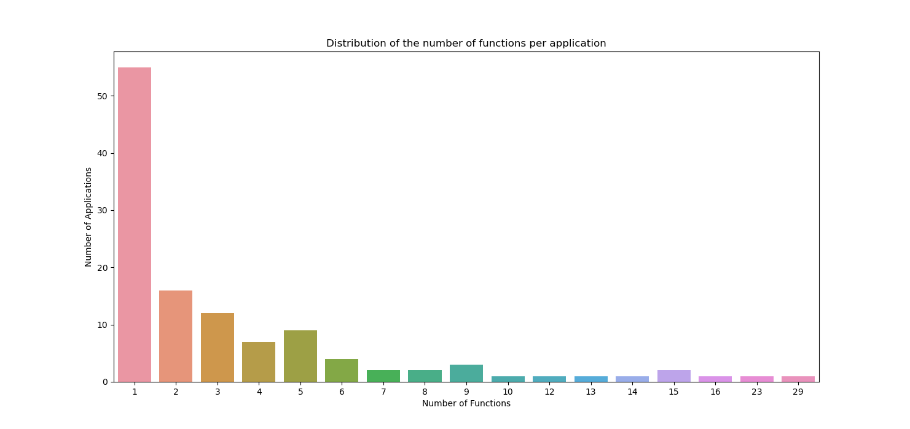

Il grafo mostra il numero delle applicazioni che hanno un certo numero di funzioni. È possibile notare che:
- molte applicazioni (55) hanno un'unica funzione associata;
- solo 3 applicazioni hanno più di 15 funzioni.

#### Numero di invocazioni per applicazione
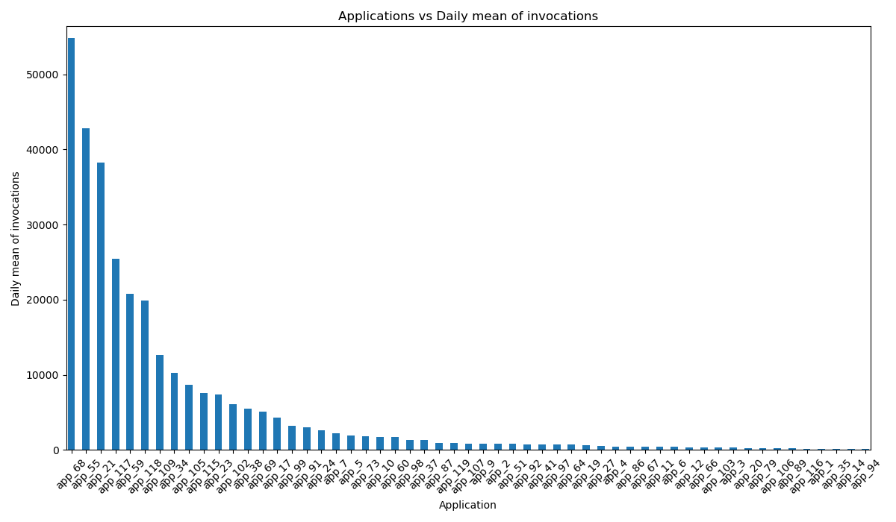

Il grafo mostra la media giornaliera del numero di invocazioni che si hanno per ogni singola applicazione.

*Per motivi di visualizzazione nell'immagine è stata riportata solo la prima parte del grafo; quindi, non sono presenti tutte le 119 applicazioni, ma solo quelle con la media di invocazioni giornaliere maggiore.*

Dalla figura è possibile notare che il numero medio di invocazioni giornaliero varia molto da applicazione ad applicazione: ci sono applicazioni le cui funzioni vengono richiamate molto frequentemente e applicazioni che vengono richiamate al più una volta al giorno.

#### Relazione fra durata media delle invocazioni e numero di funzioni dell'applicazione

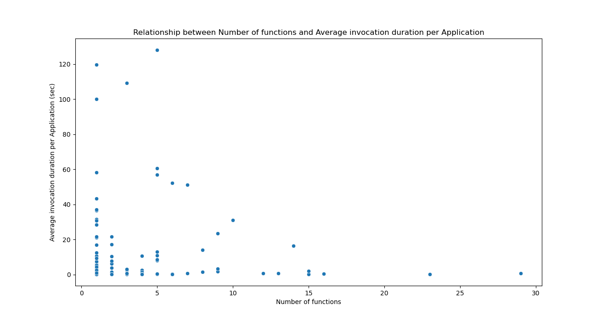

Nella figura, per ogni applicazione (indicata dal singolo puntino) è mostrato sull'asse delle *x* il numero di funzioni che la costituiscono e sull'asse delle *y* la durata media delle invocazioni.
- Come emerso dall'analisi [precedente](#numero-di-funzioni-per-applicazione), la maggior parte delle applicazioni è formata da poche funzioni. Fra queste, è possibile notare la maggiore variabilità sulla durata media delle invocazioni. 
-  Applicazioni formate da più di 11 funzioni hanno tendenzialmente una durata media delle invocazioni bassa. Questo potrebbe suggerire che le applicazioni con un numero elevato di funzioni tendono ad essere più ottimizzate e più efficienti nel loro funzionamento.

Tuttavia, il forte squilibrio tra applicazioni con poche funzioni e quelle con molte funzioni rende difficile estrarre un pattern preciso tra numero di funzioni e durata media delle invocazioni.
Questo è dovuto al fatto che la variabilità all'interno di ciascun gruppo di applicazioni (poche o molte funzioni) è troppo elevata per poter identificare una relazione lineare o una tendenza chiara. <br>
Ciò è stato confermato calcolando il coeffiente di correlazione: -0.0413, che indica una tendenza leggermente inversa, ma non statisticamente significativa essendo prossimo allo zero.

#### Durata media delle singole funzioni per ogni applicazione
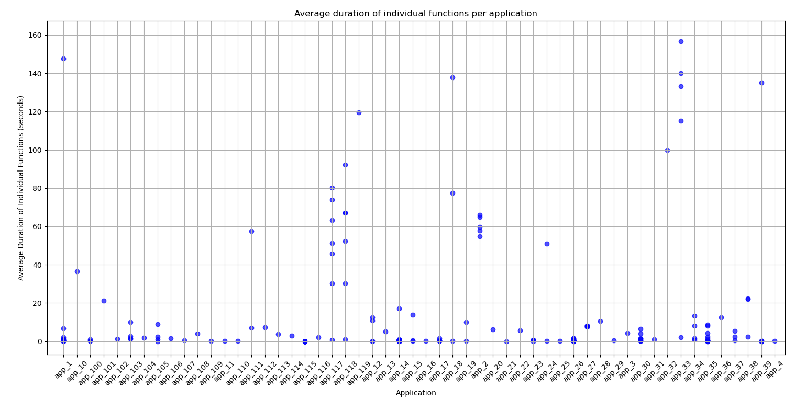
Il grafo mostra per ogni applicazione la durata media delle singole funzioni che la compongono.
Fornisce una granularità maggiore rispetto al precedente permettendo di visualizzare più nel dettaglio le applicazioni e le durate delle singole funzioni. 

#### Analisi di applicazioni con più di una funzione

L'ultima parte del codice avvia una semplice interfaccia utente da cui è possibile selezionare una fra le applicazioni che hanno più di una singola funzione. Per ogni applicazione vengono mostrati i seguenti grafi:
 
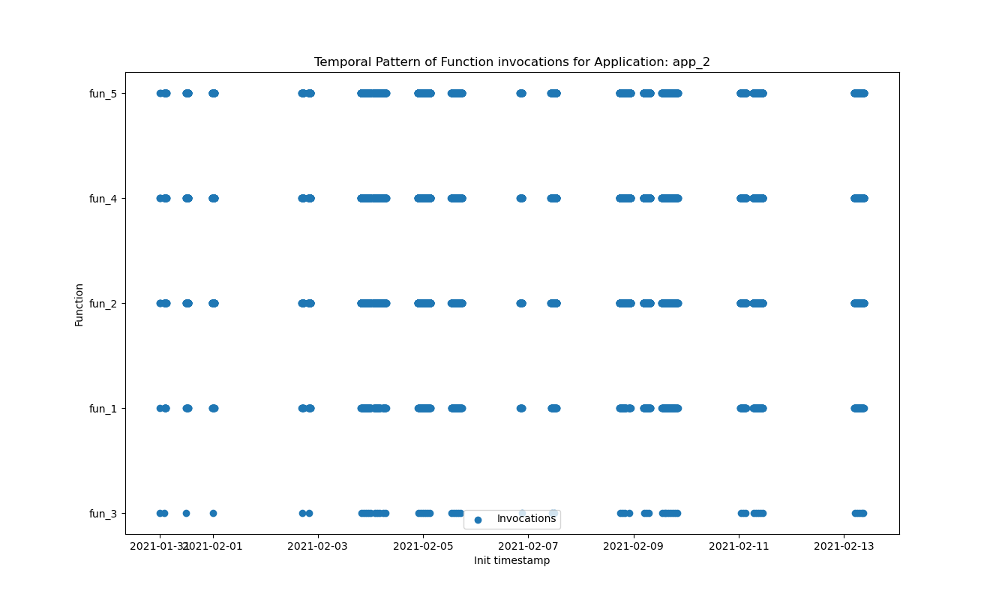

- Il fine principale del primo grafo è quello di mostrare eventuali pattern temporali che legano le invocazioni delle diverse funzioni all'interno della stessa applicazione. Infatti, le funzioni all'interno di un'applicazione possono essere progettate per lavorare insieme in modo collaborativo e, quindi, essere avviate contemporaneamente o sequenzialmente.
Questo è evidente per l'applicazione *app_2*, mostrata come esempio, dove è possibile notare che, solitamente, tutte le funzioni dell'applicazione vengono invocate in modo sincrono.
- Inoltre, il grafo permette anche di capire qual è la frequenza delle invocazioni delle funzioni nel tempo, al fine di estrapolare eventuali periodicità.

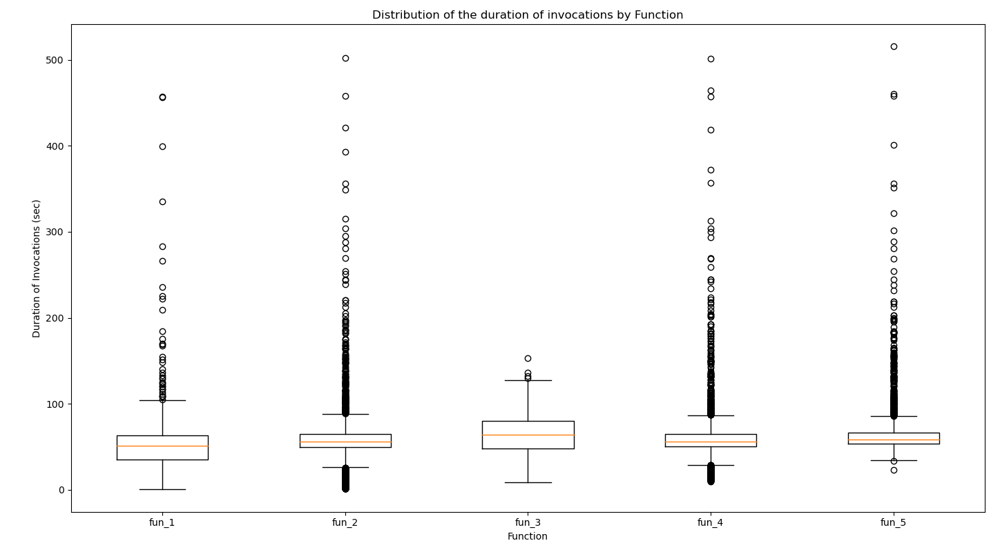

- Quest'ultimo grafo, invece, ha l'obiettivo di mostrare la distribuzione della durata delle invocazioni delle singole funzioni, evidenziando all'interno della stessa applicazione quali possono essere le funzioni problematiche che hanno una durata maggiore.
